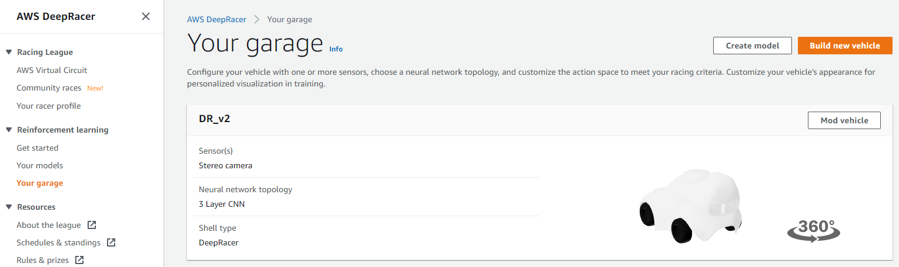
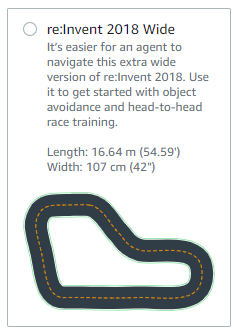
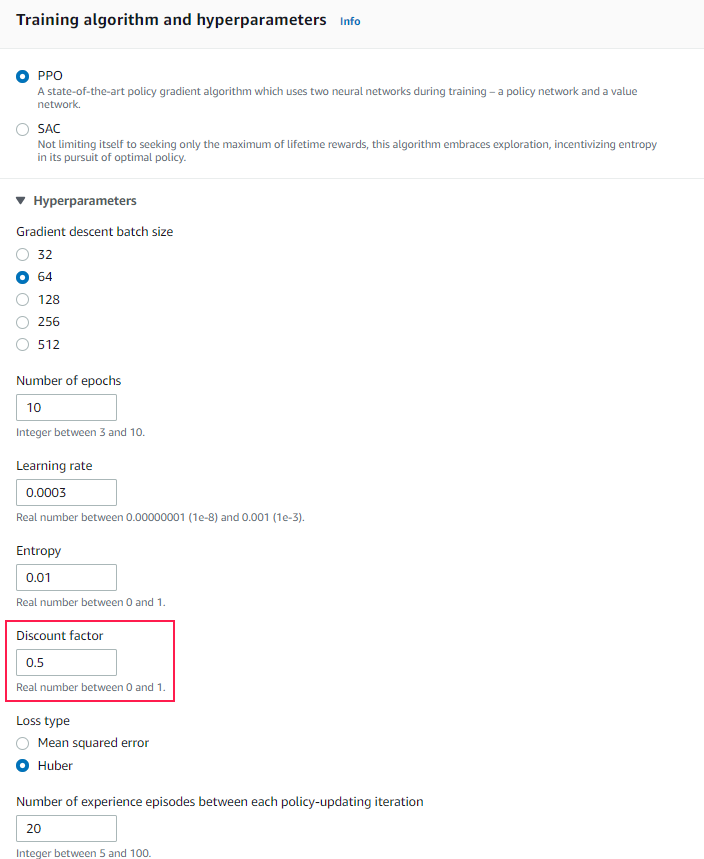
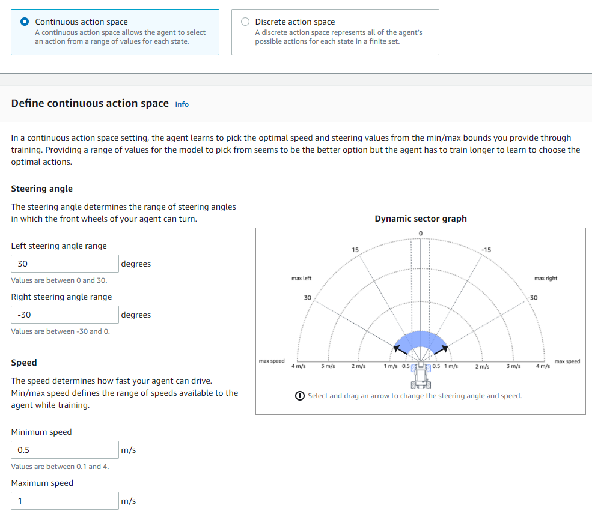
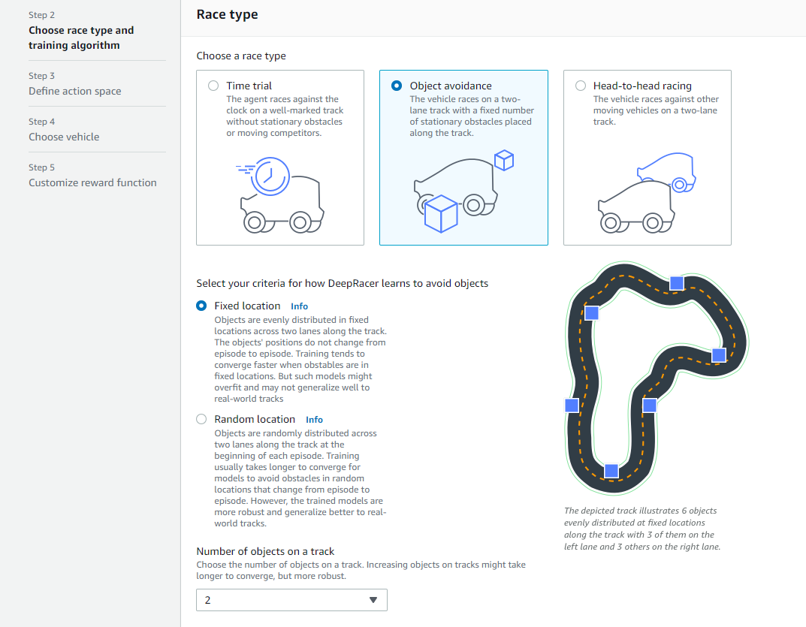

## Creating the Best Performing Model

**Note:** AWS DeepRacer console has various costs, plus tax, to use. Currently, they were: 

I had setup both daily and monthly budget alerts once my free tier had expired; however, these had a 12-18 hour delay.
The billing dashboard was also NOT a real time display of the costs.
This wasn't a problem in my case because this is similar to other AWS services I've used, I was tracking the time manually, and I had budgeted for this project.

I'm noting this for new users in case they want to try it out while minimizing costs (potentially staying within the free tier).

1) Login to AWS account.  
2) Select region N. Virginia in top right.  
3) Search for 'DeepRacer' in the top center box and select it.  
4) Select the menu bar on the DeepRacer homepage (three horizontal lines at top left).  
5) Select 'Your Garage' to create desired vehicle.  
a) Build new vehicle  
b) Personalize name, shell, and color -> Next  
c) Select 'Stereo camera' -> Done  
  
6) Select 'Your Models' -> Create model.  
7) Add model name -> Select track 're:Invent 2018 Wide'  

8) Race type  
a) Time trail.  
    -Note: This is how I did the training. 
   It is possible to skip some steps and train on object avoidance straight away. 
   See step 13 below for additional details.  
b) Training algorithm and hyperparameters -> leave all as defaults EXCEPT expand 'Hyperparameters' -> change Discount factor to 0.5 -> Next.  

9) Leave all action space options as is -> Next

10) Select vehicle created in step 5 with a stereo camera -> Next.
11) In the code editor,  
a) add the following reward function:
    
```python
# Majority of code thanks to https://github.com/TwoDigits/deepracer/blob/master/reward_function.py
# Also using code from https://docs.aws.amazon.com/deepracer/latest/developerguide/deepracer-reward-function-examples.html#deepracer-reward-function-example-3
import math


def dist(point1, point2):
    return ((point1[0] - point2[0]) ** 2 + (point1[1] - point2[1]) ** 2) ** 0.5


# thanks to https://stackoverflow.com/questions/20924085/python-conversion-between-coordinates
def polar(x, y):
    """
    returns r, theta(degrees)
    """

    r = (x ** 2 + y ** 2) ** .5
    theta = math.degrees(math.atan2(y, x))
    return r, theta


def angle_mod_360(angle):
    """
    Maps an angle to the interval -180, +180.
    Examples:
    angle_mod_360(362) == 2
    angle_mod_360(270) == -90
    :param angle: angle in degree
    :return: angle in degree. Between -180 and +180
    """

    n = math.floor(angle/360.0)

    angle_between_0_and_360 = angle - n*360.0

    if angle_between_0_and_360 <= 180.0:
        return angle_between_0_and_360
    else:
        return angle_between_0_and_360 - 360


def get_waypoints_ordered_in_driving_direction(params):
    # waypoints are always provided in counter clock wise order
    if params['is_reversed']:  # driving clock wise.
        return list(reversed(params['waypoints']))
    else:  # driving counter clock wise.
        return params['waypoints']


def up_sample(waypoints, factor):
    """
    Adds extra waypoints in between provided waypoints
    :param waypoints:
    :param factor: integer. E.g. 3 means that the resulting list has 3 times as many points.
    :return:
    """
    p = waypoints
    n = len(p)

    return [[i / factor * p[(j+1) % n][0] + (1 - i / factor) * p[j][0],
             i / factor * p[(j+1) % n][1] + (1 - i / factor) * p[j][1]] for j in range(n) for i in range(factor)]


def get_target_point(params):
    waypoints = up_sample(get_waypoints_ordered_in_driving_direction(params), 20)

    car = [params['x'], params['y']]

    distances = [dist(p, car) for p in waypoints]
    min_dist = min(distances)
    i_closest = distances.index(min_dist)

    n = len(waypoints)

    waypoints_starting_with_closest = [waypoints[(i+i_closest) % n] for i in range(n)]

    r = params['track_width'] * 0.9

    is_inside = [dist(p, car) < r for p in waypoints_starting_with_closest]
    i_first_outside = is_inside.index(False)

    if i_first_outside < 0:  # this can only happen if we choose r as big as the entire track
        return waypoints[i_closest]

    return waypoints_starting_with_closest[i_first_outside]


def get_target_steering_degree(params):
    tx, ty = get_target_point(params)
    car_x = params['x']
    car_y = params['y']
    dx = tx-car_x
    dy = ty-car_y
    heading = params['heading']

    _, target_angle = polar(dx, dy)

    steering_angle = target_angle - heading

    return angle_mod_360(steering_angle)


def score_steer_to_point_ahead(params):
    best_steering_angle = get_target_steering_degree(params)
    steering_angle = params['steering_angle']

    error = (steering_angle - best_steering_angle) / 60.0  # 60 degree is already really bad

    score = 1.0 - abs(error)

    return max(score, 0.01)  # optimizer is rumored to struggle with negative numbers and numbers too close to zero


def avoid_object(params):
    objects_location = params['objects_location']
    agent_x = params['x']
    agent_y = params['y']
    _, next_object_index = params['closest_objects']
    objects_left_of_center = params['objects_left_of_center']
    is_left_of_center = params['is_left_of_center']

    # Penalize if the agent is too close to the next object
    reward_avoid = 1.0
    # Distance to the next object
    next_object_loc = objects_location[next_object_index]
    distance_closest_object = math.sqrt((agent_x - next_object_loc[0]) ** 2 + (agent_y - next_object_loc[1]) ** 2)
    # Decide if the agent and the next object is on the same lane
    is_same_lane = objects_left_of_center[next_object_index] == is_left_of_center
    if is_same_lane:
        if 0.5 <= distance_closest_object < 0.8:
            reward_avoid *= 0.5
        elif 0.3 <= distance_closest_object < 0.5:
            reward_avoid *= 0.2
        elif distance_closest_object < 0.3:
            reward_avoid = 1e-3  # Likely crashed
    return reward_avoid


def reward_function(params):
    return float(score_steer_to_point_ahead(params) + 4.0 * avoid_object(params))
```
b) Click 'Validate' -> expect to get a message saying 'Your reward function passed validation'.  
c) Stop conditions -> set maximum time equal to 120 minutes.  
-Note: It is possible to manually stop the training early if the model has a good completion percentage.  
d) Decide if you want to submit your model to the DeepRacer League.  
    - Unchecked this box because I didn't submit any models.  
    - However, if you want to you can do it here or later.  
e) Note whatever the current costs are for your setup -> assuming everything looks good -> Create model.

12) Once the model has finished training (or it was manually stopped early) it is time to evaluate the results.  
13) Assuming the evaluation successfully completed the course 3 times it is time to add objects.  
a) In the model -> Actions pull down -> clone model.  
b) Go through the step above again and select to same options EXCEPT for change race type to:  
8a) Object avoidance -> Fixed locations -> Number of objects on track = 2.  
