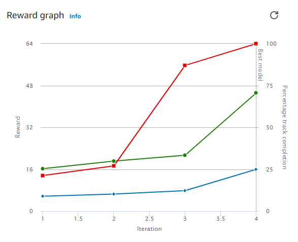
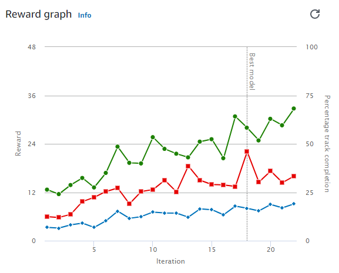
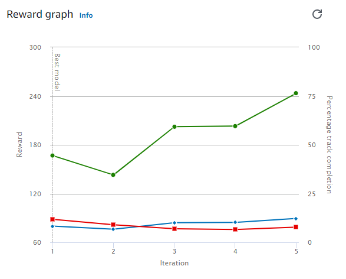
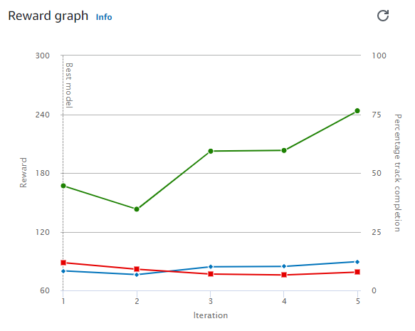
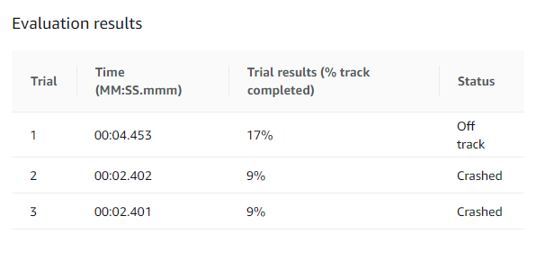

# Models that did not pass evaluation

There were several groupings for the model's result into ones that did:  
a) very poorly and declined for average percentage completed for training and evaluating.  
b) very little and remained flat throughout.  
c) ok but not converging fast enough.  
d) very well and improved to close to 100% completion.

This file contains the first 3 examples above. 
The ones that did well will be in other markdown files with additional evaluation results.

## Reward Graph Legend

## Training Progress

This one needed more training time and was cloned from an earlier model.  

These would need even more training time.  

## Little Training Progress

Some of these might be somewhat subjective; but in general they are not making progress and therefore do not need any additional training.
Instead, something in the model, such as the reward function, should be adjusted before training further.  

## Declining Training Progress

This example was cloned from an earlier model. The previous results did not translate well to this new model.

## Unable to Train
This was the final type of grouping for the models.
There are a lot of code examples online for AWS Deepracer.
Several that looked promising turned out to really only be snippets or were apparently outdated.

To help avoid the initial training setup time there is a validate button for the reward code block section.
In addition, I was using Pycharm as my IDE which helped identify code issues.
Finally, there are multiple log files, if the reward example validates but then errors out during training, that can help with troubleshooting.
