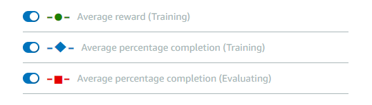

# Object Avoidance V5

## Evaluation Results 
| Trial | Time (MM:SS.mmm) | Trial results (% track completed) | Status |
| ---: | :---: | :---: | --- |
| 1 | 00:25.400 | 100% | Lap complete |
| 2 | 00:24.000 | 100% | Lap complete |
| 3 | 00:24.668 | 100% | Lap complete |

## Training Reward Graph 




## Training Configuration

### Framework  
Tensorflow

### Reinforcement learning algorithm  
PPO

### Environment simulation  
re:Invent 2018 Wide  

### Reward function  
```python
# Majority of code thanks to https://docs.aws.amazon.com/deepracer/latest/developerguide/deepracer-reward-function-examples.html#deepracer-reward-function-example-3
import math
def reward_function(params):
    """
    Example of rewarding the agent using multiple incentives and punishments.
    """
    all_wheels_on_track = params['all_wheels_on_track']
    objects_location = params['objects_location']
    agent_x = params['x']
    agent_y = params['y']
    _, next_object_index = params['closest_objects']
    objects_left_of_center = params['objects_left_of_center']
    is_left_of_center = params['is_left_of_center']
    progress = params['progress']

    # Initialize reward with a small number but not zero
    # because zero means off-track or crashed
    reward = 1e-3

    # Reward if the agent stays inside the two borders of the track
    if all_wheels_on_track and not is_left_of_center:
        reward_lane = 5.0
    else:
        reward_lane = 1e-3

    # Reward based on progress
    reward_progress = progress * 0.5
    # Bonus reward when complete course
    if progress == 100:
        reward += 200

    # Penalize if the agent is too close to the next object
    # Distance to the next object
    next_object_loc = objects_location[next_object_index]
    distance_closest_object = math.sqrt((agent_x - next_object_loc[0])**2 + (agent_y - next_object_loc[1])**2)
    if not objects_left_of_center:
        if 0.5 <= distance_closest_object < 0.8:
            if all_wheels_on_track and is_left_of_center:
                reward_lane = 5.0
            else:
                reward_lane = 1e-3
        elif 0.3 <= distance_closest_object < 0.5:
            if all_wheels_on_track and is_left_of_center:
                reward_lane = 10.0
            else:
                reward_lane = 1e-3
        else:
            reward_lane = 1e-3  # Likely crashed

    # Calculate the total reward by putting different weights on aspects above
    reward += 4.0 * reward_lane + 1.0 * reward_progress

    return reward
```

### Sensor(s)  
Stereo camera  

### Action space type  
Discrete  

### Action space
| No. | Steering angle (°) | Speed (m/s) |
| ---: | ---: | :---: |
| 0 | -30.0 | 0.50 |
| 1 | -30.0 | 1.00 |
| 2 | -15.0 | 0.50 |
| 3 | -15.0 | 1.00 |
| 4 | 0.0 | 0.50 |
| 5 | 0.0 | 1.00 |
| 6 | 15.0 | 0.50 |
| 7 | 15.0 | 1.00 |
| 8 | 30.0 | 0.50 |
| 9 | 30.0 | 1.00 |

### Hyperparameters

Gradient descent batch size	64  
Entropy	0.01  
Discount factor	0.999  
Loss type	Huber  
Learning rate	0.0003  
Number of experience episodes between each policy-updating iteration	20  
Number of epochs	10  

## Summary
- This model successfully completed the course primarily using an AWS reward function example.
- See [Reward Function Examples](AWS_DeepRacer_Reward_Function_Examples.ipynb) for additional details.
