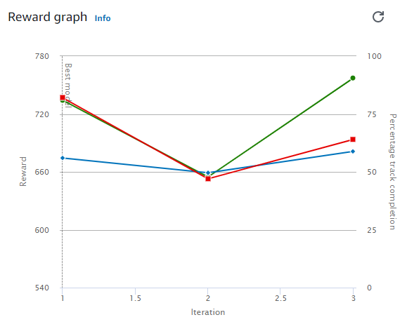

# Object Avoidance v4 Cloned from Time Trial v5
2 Fixed Objects on Track

## Evaluation Results 
| Trial | Time (MM:SS.mmm) | Trial results (% track completed) | Status |
| ---: | :---: | :---: | --- |
| 1 | 00:18.262 | 100% | Lap complete |
| 2 | 00:17.486 | 100% | Lap complete |
| 3 | 00:18.283 | 100% | Lap complete |

## Training Reward Graph




## Training Configuration

### Framework  
Tensorflow

### Reinforcement learning algorithm  
PPO

### Environment simulation
re:Invent 2018 Wide

### Reward function
```python
import math


def dist(point1, point2):
    return ((point1[0] - point2[0]) ** 2 + (point1[1] - point2[1]) ** 2) ** 0.5


# thanks to https://stackoverflow.com/questions/20924085/python-conversion-between-coordinates
def polar(x, y):
    """
    returns r, theta(degrees)
    """

    r = (x ** 2 + y ** 2) ** .5
    theta = math.degrees(math.atan2(y, x))
    return r, theta


def angle_mod_360(angle):
    """
    Maps an angle to the interval -180, +180.
    Examples:
    angle_mod_360(362) == 2
    angle_mod_360(270) == -90
    :param angle: angle in degree
    :return: angle in degree. Between -180 and +180
    """

    n = math.floor(angle/360.0)

    angle_between_0_and_360 = angle - n*360.0

    if angle_between_0_and_360 <= 180.0:
        return angle_between_0_and_360
    else:
        return angle_between_0_and_360 - 360


def get_waypoints_ordered_in_driving_direction(params):
    # waypoints are always provided in counter clock wise order
    if params['is_reversed']:  # driving clock wise.
        return list(reversed(params['waypoints']))
    else:  # driving counter clock wise.
        return params['waypoints']


def up_sample(waypoints, factor):
    """
    Adds extra waypoints in between provided waypoints
    :param waypoints:
    :param factor: integer. E.g. 3 means that the resulting list has 3 times as many points.
    :return:
    """
    p = waypoints
    n = len(p)

    return [[i / factor * p[(j+1) % n][0] + (1 - i / factor) * p[j][0],
             i / factor * p[(j+1) % n][1] + (1 - i / factor) * p[j][1]] for j in range(n) for i in range(factor)]


def get_target_point(params):
    waypoints = up_sample(get_waypoints_ordered_in_driving_direction(params), 20)

    car = [params['x'], params['y']]

    distances = [dist(p, car) for p in waypoints]
    min_dist = min(distances)
    i_closest = distances.index(min_dist)

    n = len(waypoints)

    waypoints_starting_with_closest = [waypoints[(i+i_closest) % n] for i in range(n)]

    r = params['track_width'] * 0.9

    is_inside = [dist(p, car) < r for p in waypoints_starting_with_closest]
    i_first_outside = is_inside.index(False)

    if i_first_outside < 0:  # this can only happen if we choose r as big as the entire track
        return waypoints[i_closest]

    return waypoints_starting_with_closest[i_first_outside]


def get_target_steering_degree(params):
    tx, ty = get_target_point(params)
    car_x = params['x']
    car_y = params['y']
    dx = tx-car_x
    dy = ty-car_y
    heading = params['heading']

    _, target_angle = polar(dx, dy)

    steering_angle = target_angle - heading

    return angle_mod_360(steering_angle)


def score_steer_to_point_ahead(params):
    best_steering_angle = get_target_steering_degree(params)
    steering_angle = params['steering_angle']

    error = (steering_angle - best_steering_angle) / 60.0  # 60 degree is already really bad

    score = 1.0 - abs(error)

    return max(score, 0.01)  # optimizer is rumored to struggle with negative numbers and numbers too close to zero


def avoid_object(params):
    objects_location = params['objects_location']
    agent_x = params['x']
    agent_y = params['y']
    _, next_object_index = params['closest_objects']
    objects_left_of_center = params['objects_left_of_center']
    is_left_of_center = params['is_left_of_center']

    # Penalize if the agent is too close to the next object
    reward_avoid = 1.0
    # Distance to the next object
    next_object_loc = objects_location[next_object_index]
    distance_closest_object = math.sqrt((agent_x - next_object_loc[0]) ** 2 + (agent_y - next_object_loc[1]) ** 2)
    # Decide if the agent and the next object is on the same lane
    is_same_lane = objects_left_of_center[next_object_index] == is_left_of_center
    if is_same_lane:
        if 0.5 <= distance_closest_object < 0.8:
            reward_avoid *= 0.5
        elif 0.3 <= distance_closest_object < 0.5:
            reward_avoid *= 0.2
        elif distance_closest_object < 0.3:
            reward_avoid = 1e-3  # Likely crashed
    return reward_avoid


def reward_function(params):
    return float(score_steer_to_point_ahead(params) + 4.0 * avoid_object(params))
```

### Sensor(s)  
Stereo camera

### Action space type  
Continuous

### Action space  
Speed: [ 0.5 : 1 ] m/s  
Steering angle: [ -30 : 30 ] °  

### Hyperparameters

Gradient descent batch size	64  
Entropy	0.01  
Discount factor	0.5  
Loss type	Huber  
Learning rate	0.0003  
Number of experience episodes between each policy-updating iteration	20  
Number of epochs	10

## Summary