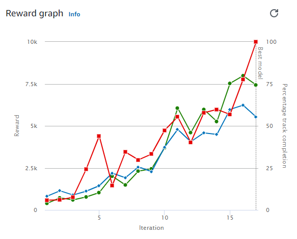

# AWS DeepRacer - Object Avoidance

## Executive Summary
- 23 models were trained from 15 minutes to 3 hours.
    - Some were also cloned from earlier versions.
- 4 models passed evaluation (3 laps without crashing).
    - 2 in time trial race types.
    - 2 in object avoidance race types with 2 fixed objects. 
    - These training times need to be increased in order to improve the performance in more general scenarios.
- Only 29% of project’s budget was used.
    
## Problem Statement
Train and evaluate reinforcement learning models using autonomous vehicles in AWS DeepRacer to avoid objects.

This project is unique from a traditional data science project because there wasn't any data wrangling, exploratory data analysis, or pre-processing.
Also, all training and evaluating of models was done inside the AWS DeepRacer console.

## AWS DeepRacer Console
The AWS DeepRacer console is a graphical user interface to interact with the AWS DeepRacer service.

It supports the following features:
- Create a training job to train a reinforcement learning model with a specified reward function,
optimization algorithm, environment, and hyperparameters.
- Choose a simulated track to train and evaluate a model by using SageMaker and AWS RoboMaker.
- Clone a trained model to improve training by tuning hyperparameters to optimize your model's
performance.
- Download a trained model for deployment to your AWS DeepRacer vehicle so it can drive in a physical
environment.
- Submit your model to a virtual race and have its performance ranked against other models in a virtual
leaderboard.

## Project Technologies
- Python
- AWS Cloud
- AWS DeepRacer
    - Amazon CloudWatch
    - Amazon SageMaker
    - Amazon S3
    - AWS RoboMaker
    - Tensorflow

## Project's Budget was $100
- Planned to evaluate progress after:
  - Free trial had expired.
  - Every $25.
- Spent $28.62 total.

- Some examples online would cost $10k+ to replicate using the cost structure above.
- See Next Steps section below for ways to help reduce these costs.

## Setup Models

### Tracks
#### AWS Summit Raceway
Created to prepare racers for the 2020 AWS DeepRacer League, the AWS Summit Raceway provides a solid training warm up for any agent.

Length: 22.57 m (74')
Width: 91 cm (36")

#### Oval Track
Inspired by Indy Speedway, the Oval Track is simple and gives the agent space to learn different strategies. It’s a good choice for getting started.

Length: 19.55 m (64.14')
Width: 76 cm (30")

#### re:Invent 2018 Wide
It’s easier for an agent to navigate this extra wide version of re:Invent 2018. Use it to get started with object avoidance and head-to-head race training.

Length: 16.64 m (54.59')
Width: 107 cm (42")

### Race Types
#### Time trial
The agent races against the clock on a well-marked track.

#### Object avoidance
The vehicle races on a two-lane track with a fixed number of stationary obstacles placed along the track.
Trained models using 1 to 4 fixed objects on different tracks.
  
### Hyperparameters
AWS recommends leaving all with the default setup unless there is a specific reason to change them.

The default settings are:

|Hyperparameter | value |
| --- | :---: |
| Gradient descent batch size | 64 |
| Number of epochs | 10 |
| Learning rate | 0.0003 |
| Entropy | 0.01 |
| Discount factor | 0.999 |
| Loss type | Huber |
| Number of experience episodes between each policy-updating iteration | 20 |

Only changed the discount factor to 0.5 for certain models to help decrease the training time as discussed [here](https://medium.com/twodigits/aws-deepracer-how-to-train-a-model-in-15-minutes-3a0dca1175fb).

### Define action space
Leave all options as defaults until a model has successfully passed evaluation.
Then, can work on increasing speed and adjusting angles.

### Vehicle Sensors
#### Front-facing camera
A single-lens front-facing camera can capture images of the environment in front of the host vehicle,
including track borders and shapes. It's the least expensive sensor and is suitable to handle simpler
autonomous driving tasks, such as obstacle-free time trials on well-marked tracks. With proper
training, it can avoid stationary obstacles on fixed locations on the track. However, the obstacle
location information is built into the trained model and, as the result, the model is likely to be
overfitted and may not generalize to other obstacle placements. With stationary objects placed at
random locations or other moving vehicles on the track, the model is unlikely to converge.

In the real world, the AWS DeepRacer vehicle comes with a single-lens front-facing camera as the
default sensor. The camera has 120-degree wide angle lens and captures RGB images that are then
converted to grey-scale images of 160 x 120 pixels at 15 frames per second (fps). These sensor
properties are preserved in the simulator to maximize the chance that the trained model transfers
well from simulation to the real world.

#### Front-facing stereo camera
A stereo camera has two or more lenses that capture images with the same resolution and
frequency. Images from the both lens are used to determine the depth of observed objects. The
depth information from a stereo camera is valuable for the host vehicle to avoid crashing into the
obstacles or other vehicles in the front, especially under more dynamic environment. However,
added depth information makes trainings to converge more slowly.

On the AWS DeepRacer physical vehicle, the double-lens stereo camera is constructed by adding
another single-lens camera and mounting each camera on the left and right sides of the vehicle. The
AWS DeepRacer software synchronizes image captures from both cameras. The captured images
are converted into greyscale, stacked, and fed into the neural network for inferencing. The same
mechanism is duplicated in the simulator in order to train the model to generalize well to a realworld environment.

#### LIDAR sensor

A LiDAR sensor uses rotating lasers to send out pulses of light outside the visible spectrum and time
how long it takes each pulse to return. The direction of and distance to the objects that a specific
pulse hits are recorded as a point in a large 3D map centered around the LiDAR unit.

For example, LiDAR helps detect blind spots of the host vehicle to avoid collisions while the vehicle
changes lanes. By combining LiDAR with mono or stereo cameras, you enable the host vehicle to
capture sufficient information to take appropriate actions. However, a LiDAR sensor costs more
compared to cameras. The neural network must learn how to interpret the LiDAR data. Thus,
trainings will take longer to converge.

On the AWS DeepRacer physical vehicle a LiDAR sensor is mounted on the rear and tilted down by 6
degrees. It rotates at the angular velocity of 10 rotations per second and has a range of 15cm to 2m.
It can detect objects behind and beside the host vehicle as well as tall objects unobstructed by the
vehicle parts in the front. The angle and range are chosen to make the LiDAR unit less susceptible to
environmental noise.

### Reward functions
The reward function is at the core of reinforcement learning. Use it to incentivize your car
(agent) to take specific actions as it explores the track (environment). Like encouraging and discouraging
certain behaviors in a pet, you can use this tool to encourage your car to finish a lap as fast as possible
and discourage it from driving off of the track or colliding with objects.

- Lambda functions written in Python.
- Used several to train the different models.
- The best performing model combined multiple examples.
- See the other markdown files, jupyter notebook, and python file for the different reward functions used.

#### Input Parameters Used
|  |   |
| --- | --- |
| all_wheels_on_track | objects_left_of_center |
| closest_objects | progress |
| distance_from_center | steering_angle |
| heading | track_width |
| is_left_of_center | waypoints |
| is_reversed | x |
| objects_location | y |

## Training Models
This is how the agent (car in this case) and models improve over time.

See steps to reproduce [creating the best performing model](Create_Best_Performing_Model.md).

### Positive Training Progress

### Slower Training Progress

### Little or Negative Training Progress

See additional details about [model that did not pass evaluation](Models_did_not_pass_evaluation.md).

## Evaluating Models
During evaluation the car no longer has access to all the setup they had during training; such as the input parameters.
Instead, it must rely on its sensors. Convolutional Neural Network (CNN) are used here, and elsewhere, to assist with image processing.

4 models were able to pass the evaluation even with the short training times allocated. 
For the 2 time trial races this meant completing 3 laps without going completely off the track.
For the 2 object avoidance races this meant completing 3 laps without going completely off the track while also avoiding 2 objects in fixed locations.

| Model details | Lap 1 (MM:SS.mmm) | Lap 2 (MM:SS.mmm) | Lap 3 (MM:SS.mmm) |
| --- | :---: | :---: | :---: |
| [Time trail version 1](Time-Trial-v1.md) | 00:26.533 | 00:26.034 | 00:26.347 |
| [Time trail version 5](Time-Trial-v5.md) | 00:17.592 | 00:17.462 | 00:18.210|
| [Object avoidance version 5](Object-Avoidance-V5.md) | 00:25.400 | 00:24.000 | 00:24.668 |
| [Object avoidance version t5.4](Object_Avoidance_v4_Clone_Time-Trial-v5.md) | 00:18.262 | 00:17.486 | 00:18.283 |

Watch the best performing object avoidance evaluation results on YouTube.

## Conclusion
- 4 models passed evaluation (3 laps without crashing)
    - 2 in time trials
    - 2 in object avoidance with 2 fixed objects
- Only 29% of project’s budget was used
- Important Setup
    - Discount factor for hyperparameters
    - Stereo camera for sensors
    - Waypoints and objects_location for parameters
    
## Next Steps
- Setup environments with lower training costs:
    - local setup.
    - using individual AWS services and spot pricing.
- Create optimal waypoints for left and right lanes using upsampling.
- Evaluate more scenarios after longer training times.

## References and Resources
- AWS (2021). [AWS DeepRacer Developer Guide](https://docs.aws.amazon.com/deepracer/latest/developerguide/awsracerdg.pdf).
- AWS (2021). [AWS DeepRacer Reward Function Examples](https://docs.aws.amazon.com/deepracer/latest/developerguide/deepracer-reward-function-examples.html).
- AWS (2021). [Input Parameters of the AWS DeepRacer Reward Function](https://docs.aws.amazon.com/deepracer/latest/developerguide/deepracer-reward-function-input.html).
- AWS (2021). [What Is AWS DeepRacer?](https://docs.aws.amazon.com/deepracer/latest/developerguide/what-is-deepracer.html).
- falktan (2019). [https://github.com/TwoDigits/deepracer](https://github.com/TwoDigits/deepracer).
- Falk Tandetzky (2019). [AWS Deepracer — How to train a model in 15 minutes](https://medium.com/twodigits/aws-deepracer-how-to-train-a-model-in-15-minutes-3a0dca1175fb).
- Kesha Williams (2020). [Get rolling with machine learning on AWS DeepRacer](https://www.youtube.com/watch?v=8uaUaPIU8_0).

