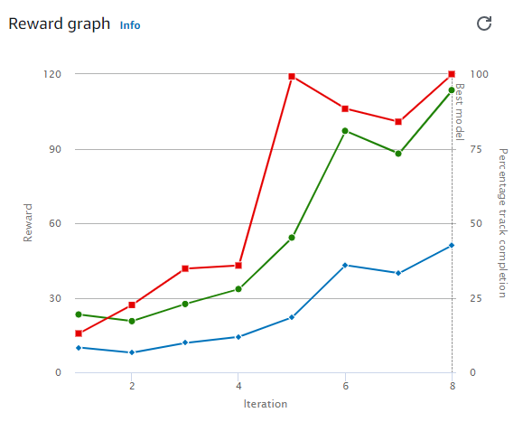

# Time Trial v1

## Evaluation Results 
| Trial | Time (MM:SS.mmm) | Trial results (% track completed) | Status |
| ---: | :---: | :---: | --- |
| 1 | 00:26.533 | 100% | Lap complete |
| 2 | 00:26.034 | 100% | Lap complete |
| 3 | 00:26.347 | 100% | Lap complete |

## Training Reward Graph




## Training Configuration

### Framework  
Tensorflow

### Reinforcement learning algorithm  
PPO

### Environment simulation  
AWS Summit Raceway

### Reward function  
```python
# Code thanks to https://docs.aws.amazon.com/deepracer/latest/developerguide/deepracer-reward-function-examples.html
def reward_function(params):
    '''
    Example of rewarding the agent to follow center line
    '''
    
    # Read input parameters
    track_width = params['track_width']
    distance_from_center = params['distance_from_center']
    
    # Calculate 3 markers that are at varying distances away from the center line
    marker_1 = 0.1 * track_width
    marker_2 = 0.25 * track_width
    marker_3 = 0.5 * track_width
    
    # Give higher reward if the car is closer to center line and vice versa
    if distance_from_center <= marker_1:
        reward = 1.0
    elif distance_from_center <= marker_2:
        reward = 0.5
    elif distance_from_center <= marker_3:
        reward = 0.1
    else:
        reward = 1e-3  # likely crashed/ close to off track
    
    return float(reward)
```

### Sensor(s)  
Camera

### Action space type  
Continuous

### Action space  
Speed: [ 0.5 : 1 ] m/s  
Steering angle: [ -30 : 30 ] °

### Hyperparameters

Gradient descent batch size	64  
Entropy	0.01  
Discount factor	0.999  
Loss type	Huber  
Learning rate	0.0003  
Number of experience episodes between each policy-updating iteration	20  
Number of epochs	10  

## Summary
- This model successfully completed the course using all default settings and a simple reward function example.
- See [Reward Function Examples](AWS_DeepRacer_Reward_Function_Examples.ipynb) for additional details.
